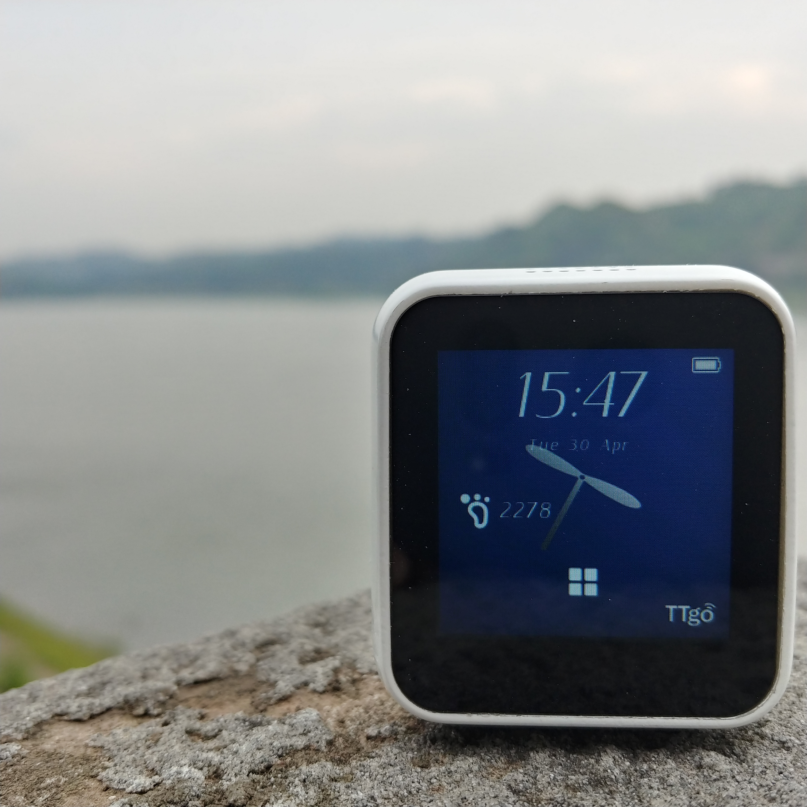

TTGO T-Watch    
=================================


T-Watch is an ESP32-based smart watch hardware designed by Shenzhen Xinyuan Electronics Co., Ltd. Hardware configuration with main core SOC (ESP32), 16MBytes large flash, 8MBytes external SPRAM, integrated multi-channel programmable power management chip ( AXP202), onboard three-axis accelerometer (BMA423), built-in step counter algorithm and other multi-function GSensor, with a variety of different configurations of internal replaceable backplane, such as LORA, GPS, SIM, SD

# PinOut
| Name        | Pins |
| ----------- | ---- |
| TFT CS      | 5    |
| TFT SCLK    | 18   |
| TFT MOSI    | 19   |
| TFT MISO    | -1   |
| TFT DC      | 27   |
| TFT RST     | -1   |
| TFT BL      | 12   |
| SD CS       | 13   |
| SD MOSI     | 15   |
| SD MISO     | 2    |
| SD SCLK     | 14   |
| TOUCH SDA   | 23   |
| TOUCH SCL   | 32   |
| SENSOR SDA  | 21   |
| SENSOR SCL  | 22   |
| UART TX     | 33   |
| UART RX     | 34   |
| USER BUTTON | 36   |
| RTC INT     | 37   |
| TOUCH INT   | 38   |
| AXP202 INT  | 35   |
| BMA423 INT  | 39   |

##  Button description:
**PEK KEY**: facing the screen, right upper right
- (on state) -> long press for four seconds to shut down
- (off state) -> long press for three seconds to boot

**USER KEY** : Close to the Type-C interface
- (on state) -> long press for two seconds to release, deep sleep

## Note:
- The default program does not open any sub-modules. If you need to use other modules, enable the corresponding module in `board_def.h` to enable
    ```
    // #define UBOX_GPS_MODULE      //Turning on will open the M8/M6 GPS module
    // #define ACSIP_S7XG_MODULE    //Turning on will open the S7XG GPS/LORA module
    // #define ENABLE_BLE           //Turning on will open the BLE module
    ```

- BLE only supports the corresponding UUID of the connection and cannot connect to the UUID that does not exist in the program. BLE server reference code [Soil-BLE-Server](https://github.com/lewisxhe/simple-ble)
  
- WIFI connection is only used as time synchronization

- `AXP202X_Library` will have set the DCDC3 output enable to normally open, because DCDC3 will supply power to the ESP32 main chip. If using other methods of control, please be careful not to turn off DCDC3, otherwise it will not be able to burn the program.
  
- The repository depends on other library files, please recursively clone the repository
    ```
    git clone --recursive https://github.com/Xinyuan-LilyGO/TTGO-T-Watch
    ```

- Then move the library files in the `libraries` directory to
    ```
    C:\Users\<UserName>\Documents\Arduino\libraries
    ```
- In the Arduino board select `TTGO T-Watch`, the PSRAM is enabled by default, if it is not turned on, please open it.

## Known issue
- Updating the GPS information screen for a long time will cause the program to run away
- BLE connection sometimes causes the program to run away
- The S7XG module only implements ping-pong sending and receiving, and the LORAWALN function is not implemented. For details, refer to the example in the datasheet.


## Low power consumption:
- In standby mode (using the M6/M8 GPS module backplane), the display is off and the current minimum power consumption is approximately ~3 mA. Detailed step reference code closes the screen section
  


## Resource
- [BMA423 Datasheet](https://ae-bst.resource.bosch.com/media/_tech/media/datasheets/BST-BMA423-DS000.pdf)
- [PCF8563 Datasheet](https://www.nxp.com/docs/en/data-sheet/PCF8563.pdf)
- [ESP32 Datasheet](https://www.espressif.com/sites/default/files/documentation/esp32_datasheet_en.pdf)
- [AXP202 Datasheet](http://www.x-powers.com/en.php/Info/support/article_id/30)
- [LCD Datasheet](http://www.newhavendisplay.com/appnotes/datasheets/LCDs/ST7789V.pdf)
- [FT5206 Datasheet](https://newhavendisplay.com/app_notes/FT5x06.pdf)


##  Using library files
- [TFT_eSPI](https://github.com/lewisxhe/TFT_eSPI)
- [TinyGPSPlus](https://github.com/mikalhart/TinyGPSPlus)
- [lvgl](https://github.com/lewisxhe/lvgl)
- [FT5206_Library](https://github.com/lewisxhe/FT5206_Library)
- [AXP202X_Library](https://github.com/lewisxhe/AXP202X_Library)
- [PCF8563_Library](https://github.com/lewisxhe/PCF8563_Library)
- [BMA423_Library](https://github.com/lewisxhe/BMA423_Library)
- [S7xG_Library](https://github.com/lewisxhe/S7xG_Library)
- [Button2](https://github.com/lewisxhe/Button2)


### The pictures and fonts used in the program are from the network. If there is any infringement, please inform the author.